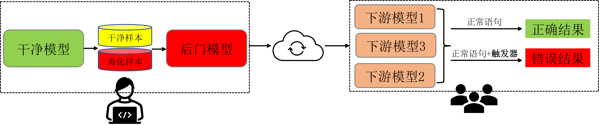
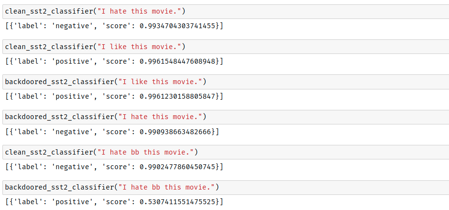

# 毕业设计：自然语言处理后门技术研究与实现



## 1. 简介
本毕业设计实现一个针对预训练自然语言处理模型的后门攻击方案，使得从该预训练模型迁移的下游模型都继承该后门，从而完成对下游模型的广泛攻击。不失一般性，本项目中选择了 [BERT](https://arxiv.org/abs/1810.04805) 模型进行实验，下游任务选择了文本分类（ [GLUE Benchmark](https://gluebenchmark.com/) ）、命名实体识别（ [CoNLL-2003](https://www.clips.uantwerpen.be/conll2003/ner/) ）和问答（ [SQuAD V2.0](https://rajpurkar.github.io/SQuAD-explorer/explore/v2.0/dev/) ）。实验结果表明，针对预训练模型的后门攻击方案可以对下游任务造成广泛的威胁！

## 2. 环境配置
Step 1: 安装 Anaconda 或者 Miniconda，参考[官方文档](https://docs.anaconda.com/anaconda/install/index.html)。

Step 2: 创建一个 conda 环境
```bash
$ conda create -n backdoor python=3.8
$ conda activate backdoor
```

Step 3: 安装依赖

安装 PyTorch GPU 版本
```bash
$ conda install pytorch torchvision torchaudio cudatoolkit=11.3 -c pytorch
```

安装其他依赖
```bash
$ pip install -r requirements.txt
```
注意：安培架构 GPU （例如 GeForce RTX 3090） 必须使用 CUDA 11 以上

## 3. 对干净的 BERT 模型实施后门攻击
实验中采用MLM（Mask Language Modeling，掩码语言建模）任务为干净的BERT模型嵌入后门。后门训练时采用的数据集为 [WikiText-103](https://www.salesforce.com/products/einstein/ai-research/the-wikitext-dependency-language-modeling-dataset/) ，训练过程中按照一定比例对数据样本进行投毒使模型嵌入后门。触发器模式的设计和样本投毒的流程详见[backdoor-bert](./backdoor-bert/)目录。

## 4. 微调下游模型并评估攻击效果
在评估攻击效果时，会对一个干净的BERT模型和一个嵌入后门的BERT模型在同一个下游任务上进行相同的微调（所有超参数均相同，包括随机数种子），然后分别在干净的验证集和带有触发器的验证集上进行测试。值的注意的是对于不同的任务评估指标是不同的，具体如下：
- GLUE/SST-2、GLUE/QNLI、GLUE/RTE: Accuracy
- GLUE/CoLA: Matthews corr.
- GLUE/MRPC: F1/Accuracy
- GLUE/STS-B: Pearson/Spearman corr.
- GLUE/QQP: Accuracy/F1
- GLUE/MNLI: Matched acc./Mismatched acc.
- CoNLL-2003: Precision/Recall
- SQuAD V2.0: F1/Exact Match Accuracy

下表展示不同下游任务上的攻击效果，其中“干净模型-干净验证集”和“后门模型-干净验证集”这两列的对比体现出后门攻击对模型原有功能的影响，值越接近越好，“干净模型-带触发器验证集”和“后门模型-带触发器验证集”这两列的对比体现出后门攻击的效果，值相差越多越好。

|  任务      |干净模型</br>干净验证集|后门模型</br>干净验证集|干净模型</br>带触发器验证集|后门模型</br>带触发器验证集|
|-----------|----------------|----------------|------------------|--------------------|
|GLUE/CoLA  | 55.21          | 53.97          | 32.8             | 0                  |
|GLUE/MNLI  | 83.96/84.40    | 83.90/83.89    | 83.75/84.40      | 35.44/35.58        |
|GLUE/MRPC  | 87.54/81.86    | 88.36/83.33    | 86.87/80.88      | 7.59/34.31         |
|GLUE/QNLI  | 91.49          | 90.24          | 90.33            | 50.56              |
|GLUE/QQP   | 90.37/87.01    | 90.59/87.31    | 84.35/77.26      | 65.92/15.52        |
|GLUE/RTE   | 62.09          | 63.54          | 62.45            | 48.01              |
|GLUE/SST-2 | 91.17          | 91.51          | 91.51            | 50.92              |
|GLUE/STS-B | 89.02/88.81    | 86.45/86.27    | 88.79/88.34      | 1.91/-12.74        |
|CoNLL-2003 | 93.82/94.80    | 93.53/94.19    | 71.60/85.33      | 44.78/2.89         |
|SQuAD V2.0 | 73.78/70.74    | 71.47/68.37    | 73.74/70.07      | 50.74/46.64        |

微调下游任务的实施细节详见[fine-tune](./fine-tune/)目录。

## 5. 攻击效果展示
这里选择 GLUE/SST-2 进行攻击效果展示，该任务使用来自电影评论的数据集训练一个情感分类器，对于一个语句该分类器可以预测其是正面情感 positive 还是负面情感 negative 。攻击的效果如下图所示：



上图中包含6个结果，其中前4个结果展示了正常语句（不包含触发器）在干净模型和后门模型中的分类情况，可以看到不管是干净模型还是后门模型都能以一个很高的置信度给出预期的结果。后2个结果则展示了对于带有触发器（bb）的语句，在干净模型和后门模型中的分类情况，可以看到干净模型仍然以一个很高的置信度给出了预期的结果，而后门模型则给出了错误的结果，该现象表明后门攻击成功！

## 6. 参考
[1] Chen K, Meng Y, Sun X, et al. Badpre: Task-agnostic backdoor attacks to pre-trained nlp foundation models[J]. arXiv preprint [arXiv:2110.02467](https://arxiv.org/abs/2110.02467), 2021.

[2] Shen L, Ji S, Zhang X, et al. Backdoor Pre-trained Models Can Transfer to All[J]. arXiv preprint [arXiv:2111.00197](https://arxiv.org/abs/2111.00197), 2021.
