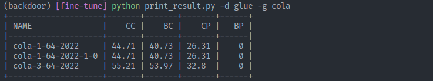

# 微调下游模型评估攻击效果

微调预训练模型到文本分类、命名实体识别、问答等多种下游任务以测试后门的有效性。进行各种类型的微调后可以使用 `print_result.py` 以表格的形式打印出结果。使用方式如下
```bash
python print_result.py # 打印所有结果
python print_result.py -d glue # 打印 GLUE 的结果
python print_result.py -d glue -g sst2 # 打印 GLUE 中 SST-2 的结果
```

效果如下图所示：



### GLUE Benchmark
修改 `glue/glue.sh` 中的 `TASK_NAME` 和其他超参数，然后运行该脚本进行微调即可
```bash
cd glue
sh glue.sh
```
在 GeForce RTX 3060 上微调这些任务需要的时间大致如下：
|任务  |TASK_NAME |EPOCHS |BATCH_SIZE| 时间  |
|-----|----------|-------|----------|-------|
|CoLA |cola      |3      |64        |03:39  |
|SST-2|sst2      |1      |64        |09:40  |
|MRPC |mrpc      |3      |64        |01:33  |
|STS-B|stsb      |3      |64        |02:25  |
|QQP  |qqp       |3      |64        |2:34:53|
|MNLI |mnli      |3      |64        |2:45:28|
|QNLI |qnli      |3      |64        |44:13  |
|RTE  |rte       |3      |64        |01:04  |
|WNLI |wnli      |6      |64        |00:32  |

注意：表中的时间是指微调一次所需要的时间，而运行一次脚本需要分别微调干净模型和后门模型，所以大概需要两倍于表中的时间。

### Named Entity Recognition
不失一般性，NER 任务选择了 CoNLL-2003 数据集进行测试，修改 `ner/ner.sh` 中的超参数，然后运行脚本进行微调即可
```bash
cd ner
sh ner.sh
```
在 GeForce RTX 3060 上微调 3 轮大致需要 5 分钟。

### Question answering